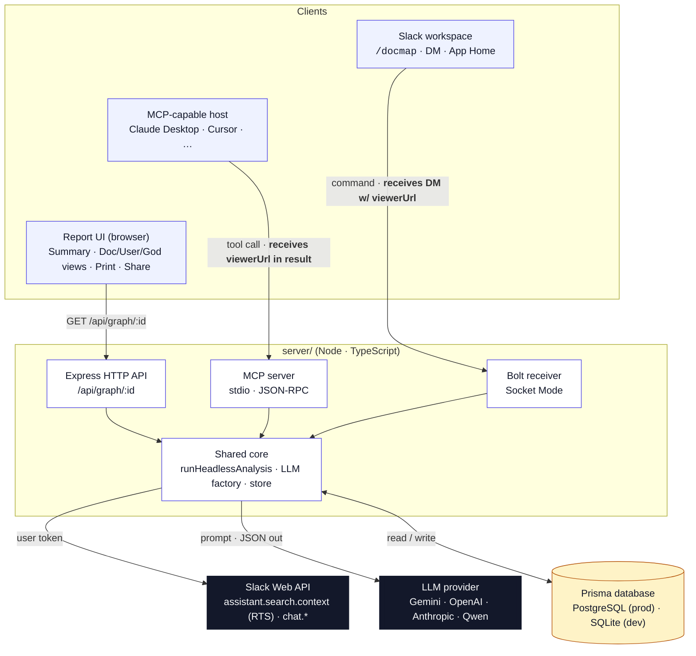

# DocMap architecture

DocMap has two triggers (Slack slash command, MCP tool) that call **one
backend**, which stores every generated graph under a UUID and hands back
a URL to the **Report UI** for the interactive viewer. The diagram below
shows the *intended* persistence layer — a Prisma-managed database
(SQLite for local dev, PostgreSQL for production).

> **Current state (hackathon deploy):** the deployed GCE VM and local
> dev both use an in-memory graph store instead of the Prisma database
> shown in the diagram. The Prisma schema is preserved at
> `server/prisma/schema.prisma` for when the persistence toggle
> (`PERSISTENCE=prisma|memory`) lands. Every other edge in the diagram
> is unchanged.

## System diagram



The outer `flowchart TB` stacks the rows top-down (Clients on top, Server
middle, External at the bottom). Inside each subgraph `direction LR` lays the
sub-items side-by-side so the band reads left-to-right and sub-nodes don't
push each other to opposite edges with a big empty gap in the middle. The
invisible `~~~` edges are the ranking trick that keeps Mermaid from floating
the Clients row next to the externals.

## Flow (annotated)

1. **Trigger** happens on one of two entry points:
   - A Slack workspace user runs `/docmap` (slash command, DM, or App Home).
     Bolt's Socket Mode receiver picks up the event.
   - A user in an MCP-capable AI host (Claude Desktop, Cursor, Claude Code,
     other agents) calls the `docmap.analyze` tool. The DocMap MCP server
     picks up the JSON-RPC request.
2. Both entry points hand off to **`runHeadlessAnalysis()`** inside the
   server's shared core (`server/src/pipeline.ts`) — the single source of
   truth for how DocMap generates a graph.
3. The helper calls Slack's **Real-Time Search API**
   (`assistant.search.context`) with a `has:link` filter scoped to the
   selected channel(s) and timeframe. It paginates up to 100 messages, then
   calls the LLM via the provider selected by `ACTIVE_LLM`.
4. The LLM returns a `DocmapGraph` — users, docs, edges, and a markdown
   summary. The helper writes it to the Prisma `Graph` table under a fresh
   UUID and returns `{ graphId, viewerUrl }`.
5. **Handoff to the client**:
   - Slack path: Bolt formats the graph as a Block Kit message (top docs +
     view switcher + *Open interactive map* button) and DMs it to the invoker.
   - MCP path: the tool response returns the JSON payload + `viewerUrl` to
     the AI host, which composes its own natural-language reply and offers
     the viewer URL as a link.
6. When either user opens the viewer URL, the **Report UI** (React + React
   Flow, running in the browser) becomes a third client — it fetches the
   graph via `GET /api/graph/:id`, hits the same Prisma store, and renders
   the summary + interactive map identically regardless of which trigger
   produced it.

## Data model (Prisma)

Prisma is the app's persistence layer in **both dev and prod** — only the
datasource `provider` differs:

- **Dev**: `provider = "sqlite"`, `DATABASE_URL="file:./dev.db"`. Zero setup.
- **Prod**: `provider = "postgresql"`, `DATABASE_URL="postgresql://…"`. Same
  schema, no code changes.

| Model | Purpose |
| --- | --- |
| `Graph` | Each analysis result — `id`, `graphJson`, `channelCount`, `days`, `createdAt`. |
| `UserPref` | Per-user Slack preferences — timeframe default, skip-form, auto-save. Keyed by `(slackTeamId, slackUserId)`. |

`Workspace` (tier / usage / BYOK keys) exists in the schema for a future
monetization layer but is not consulted in the current build.

## Where things live

```
slack-docmap/
├── server/
│   └── src/
│       ├── index.ts          # HTTP API + Bolt (Slack surface)
│       ├── mcp/server.ts     # MCP server (MCP surface)
│       ├── pipeline.ts       # runHeadlessAnalysis (shared core)
│       ├── llm/              # provider adapters + factory
│       ├── slack.ts          # assistant.search.context (RTS) wrapper
│       ├── store.ts          # Prisma-backed Graph store
│       └── blocks.ts         # Block Kit builders
├── ui/                       # Vite + React + React Flow viewer
└── samples/slack-seed-messages.md   # demo channel content
```

## Rendering this diagram

The Mermaid block above renders inline on GitHub and in most Markdown
viewers. To export a static image for the docs page or a slide deck:

```bash
# Install Mermaid CLI once
pnpm dlx @mermaid-js/mermaid-cli -h

# Extract this file's mermaid block, render as PNG/SVG
pnpm dlx @mermaid-js/mermaid-cli -i architecture.md -o ui/public/architecture.svg
# or
pnpm dlx @mermaid-js/mermaid-cli -i architecture.md -o ui/public/architecture.png -b transparent -s 2
```

Save the output under `ui/public/` (as `architecture.svg` or `.png`) and the
docs page picks it up automatically from `/architecture.<ext>`.
